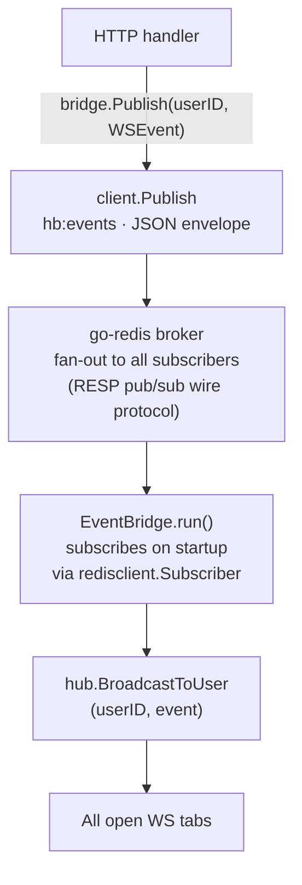

# Redis Integration

## Overview

`services/go-redis` is a custom Redis-compatible server written in Go (git submodule).
It is the only Redis dependency — no external Redis installation is required.

Module: `github.com/hiendvt/go-redis`

The backend uses go-redis for three things:
1. **Caching** — habit lists are cached as JSON to avoid repeated DB queries
2. **Counters** — streak values and daily completion counts stored as integers
3. **Realtime events** — pub/sub on `hb:events` fans out WebSocket notifications across API instances

---

## Supported Commands

| Category   | Commands |
|------------|----------|
| Strings    | `SET`, `GET`, `DEL`, `EXISTS`, `KEYS`, `MSET`, `MGET`, `SETNX`, `SETEX`, `PSETEX`, `GETSET`, `GETDEL`, `APPEND`, `STRLEN` |
| Counters   | `INCR`, `INCRBY`, `DECR`, `DECRBY` |
| Expiry     | `EXPIRE`, `PEXPIRE`, `TTL`, `PTTL`, `PERSIST` |
| Hashes     | `HSET`, `HMSET`, `HGET`, `HDEL`, `HGETALL`, `HMGET`, `HLEN`, `HEXISTS`, `HKEYS`, `HVALS`, `HINCRBY` |
| Pub/Sub    | `PUBLISH`, `SUBSCRIBE`, `UNSUBSCRIBE`, `PSUBSCRIBE`, `PUNSUBSCRIBE` |
| Connection | `PING`, `SELECT` |
| Admin      | `INFO`, `DBSIZE`, `TYPE`, `RENAME`, `FLUSHDB`, `FLUSHALL`, `COMMAND` |

---

## Backend RESP Client

`apps/api/internal/redisclient/client.go` speaks RESP directly over TCP — no Redis library is used.

```go
client, _ := redisclient.NewClient("localhost:6379")

// String operations
client.Set("hb:habit:abc:streak", "7")
val, found, _ := client.Get("hb:habit:abc:streak")
client.Del("hb:user:xyz:habits")

// Native counter — uses INCR command
n, _ := client.Incr("hb:user:xyz:total")   // → 1, 2, 3, …

// Publish a realtime event
n, _ := client.Publish("hb:events", `{"userID":"xyz","type":"HABIT_COMPLETED",...}`)
```

For pub/sub subscriptions a **dedicated connection** is required (a subscribed connection cannot issue regular commands):

```go
sub, _ := redisclient.NewSubscriber("localhost:6379")
sub.Subscribe("hb:events")

for msg := range sub.Messages() {
    fmt.Println(msg.Channel, msg.Payload)
}
```

---

## Key Naming Convention

All keys are prefixed with `hb:` to namespace the application.

```
hb:user:{userId}:habits          → JSON array of Habit objects (cache)
hb:habit:{habitId}:streak        → integer string, current streak
hb:habit:{habitId}:last_date     → "YYYY-MM-DD" of last completion
hb:user:{userId}:daily:{date}    → integer count for that date
hb:user:{userId}:total           → lifetime completions integer
hb:events                        → pub/sub channel for WebSocket events
```

---

## Cache Invalidation Strategy

go-redis supports `EXPIRE` / `TTL`, but the habit-buddy cache uses manual invalidation for simplicity — a DEL on write, rebuild on the next read.

Invalidation points:
- `CreateHabit`, `UpdateHabit`, `ArchiveHabit` → `DEL hb:user:{id}:habits`
- `CompleteHabit`, `UndoCompletion` → `DEL hb:user:{id}:habits`

---

## Realtime Pub/Sub Architecture

Completing a habit triggers a Redis-routed event instead of a direct in-process broadcast. This decouples the HTTP handler from the WebSocket hub and allows multiple API instances to each fan-out to their own clients.



**Key files:**

| File | Role |
|------|------|
| `internal/redisclient/client.go` | `Publish(channel, message)` method |
| `internal/redisclient/subscriber.go` | `Subscriber` — dedicated pub/sub connection, decodes RESP push frames |
| `internal/ws/bridge.go` | `EventBridge` — subscribes to `hb:events`, routes to WS hub |
| `internal/ws/hub.go` | Local per-process WebSocket fan-out |
| `internal/api/handlers.go` | Calls `bridge.Publish` on `CompleteHabit` / `UndoCompletion` |

**Event envelope format (JSON, sent as pub/sub payload):**

```json
{
  "userID":  "550e8400-e29b-41d4-a716-446655440000",
  "type":    "HABIT_COMPLETED",
  "payload": { "habitId": "...", "habitName": "Morning Run", "streak": 7, "completedAt": "..." }
}
```
