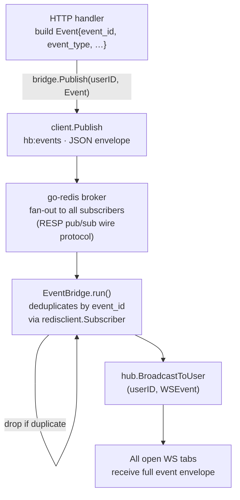

# Redis Integration

## Overview

`services/go-redis` is a custom Redis-compatible server written in Go (git submodule).
It is the only Redis dependency — no external Redis installation is required.

Module: `github.com/hiendvt/go-redis`

The backend uses go-redis for three things:
1. **Caching** — habit lists are cached as JSON to avoid repeated DB queries
2. **Counters** — streak values and daily completion counts stored as integers
3. **Realtime events** — pub/sub on `hb:events` fans out WebSocket notifications across API instances

---

## Supported Commands

| Category   | Commands |
|------------|----------|
| Strings    | `SET`, `GET`, `DEL`, `EXISTS`, `KEYS`, `MSET`, `MGET`, `SETNX`, `SETEX`, `PSETEX`, `GETSET`, `GETDEL`, `APPEND`, `STRLEN` |
| Counters   | `INCR`, `INCRBY`, `DECR`, `DECRBY` |
| Expiry     | `EXPIRE`, `PEXPIRE`, `TTL`, `PTTL`, `PERSIST` |
| Hashes     | `HSET`, `HMSET`, `HGET`, `HDEL`, `HGETALL`, `HMGET`, `HLEN`, `HEXISTS`, `HKEYS`, `HVALS`, `HINCRBY` |
| Pub/Sub    | `PUBLISH`, `SUBSCRIBE`, `UNSUBSCRIBE`, `PSUBSCRIBE`, `PUNSUBSCRIBE` |
| Connection | `PING`, `SELECT` |
| Admin      | `INFO`, `DBSIZE`, `TYPE`, `RENAME`, `FLUSHDB`, `FLUSHALL`, `COMMAND` |

---

## Backend RESP Client

`apps/api/internal/redisclient/client.go` speaks RESP directly over TCP — no Redis library is used.

```go
client, _ := redisclient.NewClient("localhost:6379")

// String operations
client.Set("hb:habit:abc:streak", "7")
val, found, _ := client.Get("hb:habit:abc:streak")
client.Del("hb:user:xyz:habits")

// Native counter — uses INCR command
n, _ := client.Incr("hb:user:xyz:total")   // → 1, 2, 3, …

// Publish a realtime event (envelope JSON — see Event Schema below)
n, _ := client.Publish("hb:events", `{"user_id":"xyz","event":{...}}`)
```

For pub/sub subscriptions a **dedicated connection** is required (a subscribed connection cannot issue regular commands):

```go
sub, _ := redisclient.NewSubscriber("localhost:6379")
sub.Subscribe("hb:events")

for msg := range sub.Messages() {
    fmt.Println(msg.Channel, msg.Payload)
}
```

---

## Key Naming Convention

All keys are prefixed with `hb:` to namespace the application.

```
hb:user:{userId}:habits          → JSON array of Habit objects (cache)
hb:habit:{habitId}:streak        → integer string, current streak
hb:habit:{habitId}:last_date     → "YYYY-MM-DD" of last completion
hb:user:{userId}:daily:{date}    → integer count for that date
hb:user:{userId}:total           → lifetime completions integer
hb:events                        → pub/sub channel for WebSocket events
```

---

## Cache Invalidation Strategy

go-redis supports `EXPIRE` / `TTL`, but the habit-buddy cache uses manual invalidation for simplicity — a DEL on write, rebuild on the next read.

Invalidation points:
- `CreateHabit`, `UpdateHabit`, `ArchiveHabit` → `DEL hb:user:{id}:habits`
- `CompleteHabit`, `UndoCompletion` → `DEL hb:user:{id}:habits`

---

## Event Schema

All events published to Redis follow a canonical envelope defined in `internal/model/event.go`.

```go
type Event struct {
    EventID   string          `json:"event_id"`   // UUID v4
    EventType string          `json:"event_type"` // e.g. "habit.completed"
    Timestamp time.Time       `json:"timestamp"`  // UTC
    Producer  string          `json:"producer"`   // "api"
    Payload   json.RawMessage `json:"payload"`    // event-specific data
}
```

### Event types

| Constant | Value | Trigger |
|----------|-------|---------|
| `EventHabitCompleted` | `habit.completed` | `POST /api/habits/:id/complete` |
| `EventHabitUndone`    | `habit.undone`    | `DELETE /api/habits/:id/complete` |
| `EventHabitCreated`   | `habit.created`   | `POST /api/habits` |
| `EventHabitUpdated`   | `habit.updated`   | `PATCH /api/habits/:id` |
| `EventHabitArchived`  | `habit.archived`  | `DELETE /api/habits/:id` |

### Redis wire message (`hb:events` payload)

```json
{
  "user_id": "550e8400-e29b-41d4-a716-446655440000",
  "event": {
    "event_id":   "a1b2c3d4-e5f6-7890-abcd-ef1234567890",
    "event_type": "habit.completed",
    "timestamp":  "2026-03-18T09:15:30Z",
    "producer":   "api",
    "payload": {
      "habitId":     "habit-xyz-789",
      "habitName":   "Morning Run",
      "streak":      7,
      "completedAt": "2026-03-18T09:15:30Z"
    }
  }
}
```

### WebSocket message delivered to clients

The bridge reconstructs a `WSEvent` from the envelope. Clients receive:

```json
{
  "event_id":   "a1b2c3d4-e5f6-7890-abcd-ef1234567890",
  "type":       "habit.completed",
  "timestamp":  "2026-03-18T09:15:30Z",
  "producer":   "api",
  "payload": {
    "habitId":     "habit-xyz-789",
    "habitName":   "Morning Run",
    "streak":      7,
    "completedAt": "2026-03-18T09:15:30Z"
  }
}
```

---

## Idempotency & Deduplication

`EventBridge` maintains an in-memory ring buffer (`seenCache`, capacity 1000) of recently processed `event_id` values. If the same event is delivered more than once — e.g. due to a Redis reconnect or a replayed message — it is silently dropped before reaching the WebSocket hub.

```
event received → check seenCache(event_id)
                      ├─ seen   → drop, log "duplicate event dropped"
                      └─ unseen → record, broadcast to hub
```

The ring buffer evicts the oldest entry when full, so memory usage is bounded and requires no external TTL management.

---

## Realtime Pub/Sub Architecture

Completing a habit triggers a Redis-routed event instead of a direct in-process broadcast. This decouples the HTTP handler from the WebSocket hub and allows multiple API instances to each fan-out to their own clients.



**Key files:**

| File | Role |
|------|------|
| `internal/model/event.go` | `Event` struct + event type constants |
| `internal/model/types.go` | `WSEvent` — wire format sent to WS clients |
| `internal/redisclient/client.go` | `Publish(channel, message)` method |
| `internal/redisclient/subscriber.go` | `Subscriber` — dedicated pub/sub connection, decodes RESP push frames |
| `internal/ws/bridge.go` | `EventBridge` — subscribes to `hb:events`, deduplicates, routes to WS hub |
| `internal/ws/hub.go` | Local per-process WebSocket fan-out |
| `internal/api/handlers.go` | Builds `Event` with UUID + timestamp, calls `bridge.Publish` |

---

## Structured Logging

All components use `log/slog` with a JSON handler (initialized in `internal/logger/logger.go`). Every stage of the event lifecycle emits a structured log line:

```json
{"time":"2026-03-18T09:15:30Z","level":"INFO","msg":"publishing event",              "component":"habit_handler", "event_id":"a1b2…","event_type":"habit.completed","habit_id":"…","user_id":"…"}
{"time":"2026-03-18T09:15:30Z","level":"INFO","msg":"event published to Redis",       "component":"event_bridge",  "event_id":"a1b2…","event_type":"habit.completed","user_id":"…","producer":"api"}
{"time":"2026-03-18T09:15:30Z","level":"INFO","msg":"event received from Redis subscriber","component":"event_bridge","event_id":"a1b2…","event_type":"habit.completed","user_id":"…","producer":"api"}
{"time":"2026-03-18T09:15:30Z","level":"INFO","msg":"broadcasting event to WebSocket clients","component":"event_bridge","event_id":"a1b2…","event_type":"habit.completed","user_id":"…"}
```

Duplicate events produce:
```json
{"time":"…","level":"INFO","msg":"duplicate event dropped","component":"event_bridge","event_id":"a1b2…","event_type":"habit.completed"}
```
